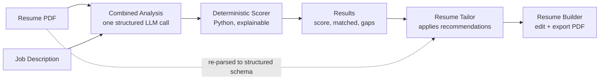

# WorthyApply

<div align="center">

**Make every application worth submitting.**

An AI copilot that reads a job description, scores your resume against it with evidence-based precision, and tailors your resume for that role — using only experience you actually have. No invented skills, no keyword stuffing.

[](https://nextjs.org/)
[](https://react.dev/)
[](https://fastapi.tiangolo.com/)
[](https://www.python.org/)
[](https://www.typescriptlang.org/)
[](https://tailwindcss.com/)

[Live Demo](https://worthyapply-sigma.vercel.app/) · [API Docs](https://worthyapply.onrender.com/docs) · [Report Issue](https://github.com/sanath-2512/Worthyapply/issues)

</div>

---

## Table of Contents

- [Overview](#overview)
- [How It Works](#how-it-works)
- [Key Features](#key-features)
- [The Honesty Principle](#the-honesty-principle)
- [Architecture](#architecture)
  - [Analysis: one call, three phases](#analysis-one-call-three-phases)
  - [Deterministic scoring](#deterministic-scoring)
  - [Tailoring](#tailoring)
  - [LLM provider router](#llm-provider-router)
- [Tech Stack](#tech-stack)
- [Project Structure](#project-structure)
- [Getting Started](#getting-started)
- [API Reference](#api-reference)
- [Environment Configuration](#environment-configuration)
- [Deployment](#deployment)
- [License](#license)

---

## Overview

Job applications are a black box. You rarely know how well your resume matches a role, and tailoring it by hand for every posting is slow and easy to get wrong.

WorthyApply closes that loop end to end:

1. **Upload & paste** — drop in your resume PDF and paste the job description.
2. **Analyze & score** — a single structured AI pass extracts the job's real requirements, checks each one against evidence in your resume, and a deterministic scorer produces an explainable 0–100 match score with matched skills and genuine gaps.
3. **Tailor** — the moment analysis finishes, WorthyApply rewrites the bullets that matter and surfaces the skills you already demonstrate, using the job's language — without inventing anything.
4. **Edit & export** — the tailored resume opens in a full builder (`/builder`) with a live A4 preview and one-click PDF export. You can also build a resume from scratch or import an existing PDF.

---

## How It Works



The job analysis, match analysis, and optimization recommendations are produced together in **one** structured generation. The score itself is then computed in **Python** from per-requirement assessments, so it is stable, auditable, and never a free-form number the model guessed.

---

## Key Features

- **Evidence-based match scoring (0–100).** Each requirement is classified `matched` / `partial` / `missing` / `cannot_verify` against real evidence in your resume, then weighted (required requirements count more than preferred). The score is explainable, not a keyword count.
- **Consistent skill sets.** Required, matched, and gap skills are reconciled deterministically so `matched + gaps == required` — the UI never shows a gap that isn't a real requirement.
- **Automatic tailoring.** Right after analysis, weak/vague bullets are rewritten for the role and skills you already demonstrate are surfaced into the skills section using the JD's terminology. Nothing is dropped from your original resume.
- **Honest gap reporting.** Requirements you don't evidence are shown as an explicit "gaps to close" list for you to add yourself *if you genuinely have them* — they are never fabricated onto the resume.
- **Full resume builder & PDF importer (`/builder`).** Structured editor with live A4 preview, section reordering, PDF import (any resume becomes editable structured data), and one-click PDF export.
- **Non-destructive tailoring.** Your previous resume is backed up locally before a tailored version is saved, so you can always restore it.
- **Resilient multi-provider LLM router.** Health-aware routing across Groq, Cohere, Mistral, OpenRouter, and Gemini with per-provider timeouts, a circuit breaker, and automatic fallback.
- **Real-time streaming (SSE).** Live agent progress and token deltas instead of a long blank spinner.

---

## The Honesty Principle

WorthyApply is deliberately built to **never fabricate experience**. This is enforced in code, not just prompts:

- The tailoring agent may only rewrite, reorder, and surface content that already exists somewhere in the resume. It cannot add a skill, employer, title, date, metric, or years-of-experience that isn't there.
- A deterministic post-processing step strips non-skills (dispositions like "willingness to learn", soft-skill phrases, education sentences) out of skill lists, and blocks any tailored bullet that would introduce an unverified requirement — moving it into an honest warning instead.
- Genuine gaps are reported to the user, not silently filled in.

Tailoring here means presenting real experience in the target role's language — not manufacturing a work history.

---

## Architecture

### Analysis: one call, three phases

`backend/pipeline.py` runs the analysis as a **single** structured LLM call (`run_combined_analysis`) that performs three reasoning phases in order and returns one typed object:

| Phase | Populates | Purpose |
|---|---|---|
| **Job analysis** | `JobAnalysis` | Extracts title, company, required vs. preferred skills, OR-groups (any-one-satisfies), experience/education requirements, keywords, and a summary. Employment type / work mode are never treated as skills. |
| **Match analysis** | `MatchAnalysis` | Produces one evidence-grounded assessment per requirement (`matched` / `partial` / `missing` / `cannot_verify`) plus matched skills and genuine gaps. |
| **Optimization** | `ResumeOptimization` | Truthful, actionable recommendations: bullet rewrites (original → improved), keywords to surface, and requirements that must not be claimed unless real. |

Running the three phases in one generation keeps them mutually consistent and avoids the latency and connection fragility of chaining separate calls. The original three-call pipeline is retained as `run_full_pipeline_legacy` for regression comparison.

### Deterministic scoring

The LLM classifies requirements; **Python owns the arithmetic** (`compute_match_score`):

- Each requirement is weighted by priority (`required` > `conditional` > `preferred` > `nice_to_have`).
- Credit per status: `matched` = full, `partial` = half, `cannot_verify` = limited, `missing` = none.
- Score = weighted credit ÷ weighted max, with a human-readable summary of how it was derived.
- The Apply / Maybe / Do Not Apply recommendation is derived from the score plus any unmet hard requirements.

A reconciliation step then rebuilds the required/matched/gap lists (with alias-aware normalization — JS = JavaScript, Postgres = PostgreSQL, etc.) so the three lists always agree.

### Tailoring

`backend/resume_tailor.py` sits after analysis and applies its recommendations to the **existing** structured resume as a small **patch** (targeted edits), not a regenerated document — so anything not explicitly edited is preserved exactly:

1. A recommendation checklist is built deterministically from the analysis (bullet improvements, priorities, keywords, missing requirements, matched/required skills).
2. The agent returns targeted edits: summary/title rewrites, per-entry bullet rewrites, skill reordering/surfacing, and section reordering.
3. The patch is applied to a deep copy; reorder operations append any indices the model omitted so no entry is ever lost.
4. Every checklist item is reconciled to an `implemented` / `not_implemented` result, and genuine gaps are returned for honest display.

### LLM provider router

`backend/llm_router/` is a health-aware router that all agents call through `get_structured_llm` / `stream_structured_llm`:

- **Providers & models:** Groq `openai/gpt-oss-120b`, Cohere `command-a-03-2025`, Mistral `mistral-small-latest`, OpenRouter `z-ai/glm-5.2`, Google Gemini `gemini-flash-latest`.
- **Default priority** (lower = tried first): `groq → cohere → mistral → openrouter → gemini`, tunable per provider via env.
- **Hard per-provider timeouts** so a hung provider is abandoned and the next healthy one is tried.
- **Circuit breaker** opens a provider after repeated failures, skips it during a cooldown, then allows a recovery trial.
- **Error-specific cooldowns** (rate-limit, timeout, auth, etc.) and structured-output validation as a fallback trigger.
- Everything is env-driven via `LLMConfig.from_env()`; nothing about routing is hardcoded across the codebase.

---

## Tech Stack

**Frontend** — [Next.js 16](https://nextjs.org/) (App Router, Turbopack) · [React 19](https://react.dev/) · [TypeScript](https://www.typescriptlang.org/) · [Tailwind CSS v4](https://tailwindcss.com/) · [Framer Motion](https://www.framer.com/motion/) · [Three.js](https://threejs.org/) via [@react-three/fiber](https://r3f.docs.pmnd.rs/) + [drei](https://github.com/pmndrs/drei)

**Backend** — [FastAPI](https://fastapi.tiangolo.com/) + [Uvicorn](https://www.uvicorn.org/) · [LangChain](https://www.langchain.com/) provider adapters + custom router · [Pydantic v2](https://docs.pydantic.dev/) · [PyPDF](https://pypdf.readthedocs.io/)

**Infrastructure** — Frontend on [Vercel](https://vercel.com), backend on [Render](https://render.com).

---

## Project Structure

```text
WorthyApply/
├── README.md
├── requirements.txt                 # Backend Python dependencies
├── main.py                          # CLI reference pipeline (source of truth for prompts)
├── backend/
│   ├── app.py                       # FastAPI endpoints + SSE streaming wrapper
│   ├── pipeline.py                  # Combined analysis + deterministic scoring + reconciliation
│   ├── resume_extractor.py          # PDF -> structured ExtractedResume
│   ├── resume_tailor.py             # Applies analysis recommendations as a resume patch
│   ├── llm.py                       # Compatibility shim over llm_router
│   └── llm_router/
│       ├── config.py                # Env-driven providers, priorities, timeouts, cooldowns
│       ├── providers.py             # Provider adapters (models, keys, params)
│       ├── router.py                # Health-aware selection + fallback execution
│       ├── circuit_breaker.py       # Per-provider fault tolerance
│       ├── health.py                # Provider health tracking
│       ├── stream_util.py           # Streaming helpers (first-token timeout)
│       └── errors.py                # Error classification
├── frontend/
│   ├── app/
│   │   ├── page.tsx                 # App flow: Landing → Workspace → Processing → Results
│   │   ├── builder/page.tsx         # Resume Builder & Editor route
│   │   ├── layout.tsx               # Root layout + pre-paint theme init
│   │   └── globals.css              # Design tokens (light/dark) + print stylesheet
│   ├── components/
│   │   ├── Landing.tsx              # Hero / landing
│   │   ├── Workspace.tsx            # Resume upload + JD input
│   │   ├── Processing.tsx           # Live streaming progress
│   │   ├── Results.tsx              # Scroll-driven analysis results
│   │   ├── results/                 # Score hero, skill map, requirements, tailoring action
│   │   ├── resume/                  # Editor, live preview, document layout, PDF import
│   │   └── ui/                      # Icon set, ThemeToggle, BackButton
│   └── lib/
│       ├── api.ts                   # SSE consumer + API client
│       ├── types.ts                 # Analysis response types
│       └── resume-types.ts          # ResumeData schema + local storage helpers
└── .env.example                     # All env vars + router tuning knobs
```

---

## Getting Started

### Prerequisites

- **Node.js** 18.18+ or 20+
- **Python** 3.10+
- **At least one LLM API key** — [Groq](https://console.groq.com), [Cohere](https://dashboard.cohere.com/), [Mistral](https://console.mistral.ai/), [OpenRouter](https://openrouter.ai/), or [Google Gemini](https://aistudio.google.com/). More keys = more fallback resilience.

### Backend Setup

```bash
# From the repo root
python3 -m venv .venv
source .venv/bin/activate          # Windows: .venv\Scripts\activate
pip install -r requirements.txt

cp .env.example .env               # then add your API key(s)
```

Add at least one key to `.env`:

```env
GROQ_API_KEY=your_groq_key_here
# Optional (each adds a fallback):
COHERE_API_KEY=your_cohere_key_here
MISTRAL_API_KEY=your_mistral_key_here
OPENROUTER_API_KEY=your_openrouter_key_here
GEMINI_API_KEY=your_gemini_key_here
```

### Frontend Setup

```bash
cd frontend
npm install
```

Create `frontend/.env.local`:

```env
NEXT_PUBLIC_API_URL=http://localhost:8000
```

### Running Locally

```bash
# Terminal 1 — Backend (from repo root)
source .venv/bin/activate
uvicorn backend.app:app --reload --port 8000

# Terminal 2 — Frontend (from frontend/)
npm run dev
```

Open **[http://localhost:3000](http://localhost:3000)**.

---

## API Reference

| Method | Endpoint | Description |
|---|---|---|
| `GET`  | `/api/health` | Health check → `{ "status": "ok" }`. |
| `POST` | `/api/analyze/stream` | Combined job + resume analysis, streamed as SSE. Final `pipeline_completed` event carries the full `AnalysisResponse`. |
| `POST` | `/api/analyze` | Non-streaming equivalent of the above. |
| `POST` | `/api/extract-resume/stream` | Converts an uploaded resume PDF into structured `ExtractedResume` JSON (streamed). |
| `POST` | `/api/extract-resume` | Non-streaming equivalent. |
| `POST` | `/api/tailor-resume/stream` | Applies the existing analysis recommendations to the resume and streams the tailored resume, applied changes, and honest gaps. |

Inputs are `multipart/form-data`: a `resume` PDF (≤ 10 MB), a `job_description` string, and — for tailoring — the `analysis` JSON returned by `/api/analyze`. Interactive docs (Swagger UI) at **`http://localhost:8000/docs`**.

---

## Environment Configuration

| Variable | Target | Required | Description |
|---|---|---|---|
| `GROQ_API_KEY` | Backend | At least one provider key | Groq (`openai/gpt-oss-120b`), default primary. |
| `COHERE_API_KEY` | Backend | Optional | Cohere fallback (`command-a-03-2025`). |
| `MISTRAL_API_KEY` | Backend | Optional | Mistral fallback (`mistral-small-latest`). Also accepts the legacy `MISTIRAL_API_KEY` spelling. |
| `OPENROUTER_API_KEY` | Backend | Optional | OpenRouter fallback (`z-ai/glm-5.2`). |
| `GEMINI_API_KEY` | Backend | Optional | Google Gemini fallback (`gemini-flash-latest`). |
| `NEXT_PUBLIC_API_URL` | Frontend | Yes | URL of the FastAPI backend. |

Router behavior (timeouts, per-provider priority, circuit-breaker thresholds, and error cooldowns) is fully tunable via optional `LLM_*` variables documented in `.env.example`.

---

## Deployment

- **Frontend** — [Vercel](https://vercel.com) with default Next.js presets. Set `NEXT_PUBLIC_API_URL` to your deployed backend.
- **Backend** — [Render](https://render.com) (or any host) running `uvicorn backend.app:app --host 0.0.0.0 --port $PORT`.

> **Note:** free-tier Render instances spin down when idle, so the first request after inactivity can take ~30–45s to warm up.

---

## License

Distributed under the **MIT License**. See `LICENSE` for details.

---

<div align="center">
Built by <a href="https://github.com/sanath-2512">Sanath</a>
</div>
