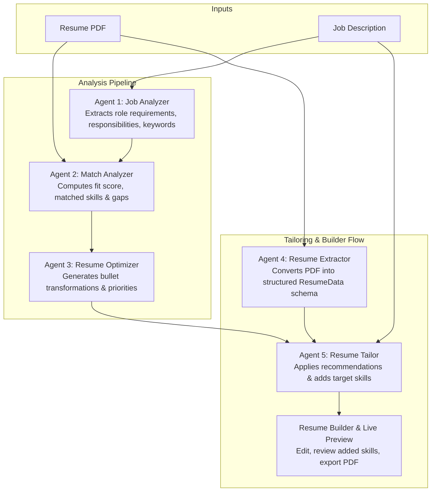

# WorthyApply

<div align="center">

**Make every application worth submitting.**

An intelligent, multi-agent AI copilot that analyzes job descriptions, scores resume fit with evidence-based precision, and automatically generates tailored resumes ready for the built-in editor and PDF export.

[](https://nextjs.org/)
[](https://react.dev/)
[](https://fastapi.tiangolo.com/)
[](https://www.python.org/)
[](https://www.typescriptlang.org/)
[](https://tailwindcss.com/)
[](LICENSE)

[Live Demo](https://worthyapply-sigma.vercel.app/) · [API Documentation](https://worthyapply.onrender.com/docs) · [Report Issue](https://github.com/sanath-2512/Worthyapply/issues)

</div>

---

## Table of Contents

- [Overview](#overview)
- [Key Features](#key-features)
- [Multi-Agent Architecture](#multi-agent-architecture)
- [Tech Stack](#tech-stack)
- [Project Structure](#project-structure)
- [Getting Started](#getting-started)
  - [Prerequisites](#prerequisites)
  - [Backend Setup](#backend-setup)
  - [Frontend Setup](#frontend-setup)
  - [Running Locally](#running-locally)
- [API Reference](#api-reference)
- [Environment Configuration](#environment-configuration)
- [Deployment](#deployment)
- [License](#license)

---

## Overview

Applying for jobs is often a frustrating black box: candidates don't know how well their resumes match role requirements, and manual tailoring for each application is tedious and error-prone.

**WorthyApply** solves this end-to-end:
1. **Parses & Extracts**: Upload your resume PDF and paste any job description.
2. **Analyzes & Scores**: A multi-agent AI pipeline computes a realistic 0–100 match score based on demonstrable evidence, detailing matched skills vs. genuine gaps.
3. **Optimizes & Tailors**: Automatically applies actionable bullet transformations and weaves job-required skills directly into your resume.
4. **Editable & Exportable**: Seamlessly transitions into a full-featured Resume Builder (`/builder`) with live A4 preview, version history backup, and one-click PDF export.

---

## Key Features

- **🎯 Evidence-Based Match Scoring (0–100)**  
  Realistic algorithmic scoring with clear verdicts (*Strong Apply*, *Moderate Fit*, or *Stretch Role*), avoiding the false confidence of generic keyword-matching tools.
- **✨ Automated Resume Tailoring**  
  Directly applies all recommendations and incorporates missing target skills into your resume. Clearly flags added skills with a friendly notice (*"If you don't have this in your tech stack, you can remove it in the editor"*).
- **📝 Full-Featured Resume Builder & Importer (`/builder`)**  
  Structured WYSIWYG editor with live A4 document scaling, drag/reorder support, and instant PDF import to turn any existing PDF into an editable structured format.
- **🛡️ Version Backup & Safety**  
  Tailoring never overwrites your previous work destructively. The app automatically creates a local backup so you can restore your original resume at any time.
- **⚡ Multi-Provider LLM Router with Fallback**  
  Resilient routing across multiple AI providers (Groq, Google Gemini, OpenRouter, Mistral, Cohere) with automatic circuit breaking and retry mechanisms.
- **🌊 Real-Time Server-Sent Events (SSE)**  
  Live streaming token deltas and agent progress updates ensure an engaging, responsive user experience without long spinners.
- **🌌 Interactive Skill Constellation & Visualizations**  
  Rich visualizations powered by Three.js, Framer Motion, and custom SVG components.

---

## Multi-Agent Architecture

WorthyApply utilizes five specialized AI agents orchestrated in a structured pipeline:



### Agent Roles & Descriptions

| Agent | Module | Input | Output | Purpose |
|---|---|---|---|---|
| **Job Analyzer** | `backend/pipeline.py` | Raw Job Description | `JobAnalysis` | Extracts standardized job title, required skills, preferred qualifications, and core keywords. |
| **Match Analyzer** | `backend/pipeline.py` | `JobAnalysis` + Resume Text | `MatchAnalysis` | Analyzes evidence in the resume against role criteria to compute a 0–100 match score and categorize skills. |
| **Resume Optimizer** | `backend/pipeline.py` | `MatchAnalysis` + Resume Text | `ResumeOptimization` | Suggests high-impact Before/After bullet transformations, priority action items, and keywords to weave in. |
| **Resume Extractor** | `backend/resume_extractor.py` | Resume PDF bytes | `ExtractedResume` | Parses arbitrary resume PDF layouts into a typed data model (Personal, Experience, Projects, Skills, Education). |
| **Resume Tailor** | `backend/resume_tailor.py` | `ExtractedResume` + Analysis | `ResumeTailorPatch` | Applies recommendations directly, injects target job skills, and logs changes for easy candidate review. |

---

## Tech Stack

### Frontend
- **Framework**: [Next.js 16](https://nextjs.org/) (App Router, Turbopack)
- **Library**: [React 19](https://react.dev/) + [TypeScript](https://www.typescriptlang.org/)
- **Styling**: [Tailwind CSS v4](https://tailwindcss.com/) + Custom CSS Design System
- **Animations & 3D**: [Framer Motion](https://www.framer.com/motion/) · [Three.js](https://threejs.org/) · [@react-three/fiber](https://r3f.docs.pmnd.rs/)

### Backend
- **Framework**: [FastAPI](https://fastapi.tiangolo.com/) + [Uvicorn](https://www.uvicorn.org/)
- **AI & Orchestration**: [LangChain](https://www.langchain.com/) + Custom Multi-Provider LLM Router
- **Data Validation**: [Pydantic v2](https://docs.pydantic.dev/)
- **Document Processing**: [PyPDF](https://pypdf.readthedocs.io/)

### Infrastructure
- **Frontend Hosting**: [Vercel](https://vercel.com)
- **Backend Hosting**: [Render](https://render.com)

---

## Project Structure

```text
WorthyApply/
├── README.md                      # Project documentation
├── requirements.txt               # Backend Python dependencies
├── backend/
│   ├── app.py                     # FastAPI application endpoints & SSE streaming
│   ├── pipeline.py                # Combined analysis pipeline (Agents 1-3)
│   ├── resume_extractor.py        # PDF extraction agent (Agent 4)
│   ├── resume_tailor.py           # Resume tailoring & skill injection agent (Agent 5)
│   ├── llm.py                     # Streaming structured LLM utility
│   ├── llm_router/                # Multi-provider fallback router
│   │   ├── providers.py           # Provider implementations (Groq, Gemini, OpenRouter)
│   │   ├── router.py              # Routing logic & fallback execution
│   │   └── circuit_breaker.py     # Health checks & fault tolerance
│   └── tests/                     # Unit and integration test suite
├── frontend/
│   ├── app/
│   │   ├── page.tsx               # Main application flow (Landing, Workspace, Results)
│   │   ├── builder/page.tsx       # Resume Builder & Editor route
│   │   └── globals.css            # Design tokens & print stylesheet
│   ├── components/
│   │   ├── Landing.tsx            # Hero and landing presentation
│   │   ├── Workspace.tsx          # Resume upload & JD input form
│   │   ├── Processing.tsx         # Real-time streaming progress indicators
│   │   ├── Results.tsx            # Scroll-driven application analysis
│   │   ├── results/
│   │   │   ├── OverviewHero.tsx   # Fit score, verdict, and breakdown
│   │   │   ├── SkillConstellation.tsx # Interactive skill visualization
│   │   │   ├── ImprovementsBlock.tsx  # Before/After bullet transformations
│   │   │   └── TailoredResumeAction.tsx # Automated tailoring & document preview
│   │   └── resume/
│   │       ├── ResumeEditor.tsx   # Structured resume section forms
│   │       ├── ResumePreview.tsx  # Scaled A4 live document view
│   │       ├── ResumeDocument.tsx # Canonical resume document layout
│   │       └── ResumeImport.tsx   # PDF import dropzone & parser
│   └── lib/
│       ├── api.ts                 # SSE consumer & API client functions
│       ├── types.ts               # Analysis response TypeScript interfaces
│       └── resume-types.ts        # ResumeData schema & storage helpers
```

---

## Getting Started

### Prerequisites

- **Node.js**: v18.18+ or v20+
- **Python**: v3.10+
- **API Key**: At least one LLM key (e.g., [Groq](https://console.groq.com), [Google Gemini](https://aistudio.google.com/), or [OpenRouter](https://openrouter.ai/))

### Backend Setup

1. Create and activate a Python virtual environment:
   ```bash
   python3 -m venv .venv
   source .venv/bin/activate  # On Windows: .venv\Scripts\activate
   ```

2. Install dependencies:
   ```bash
   pip install -r requirements.txt
   ```

3. Configure environment variables:
   ```bash
   cp .env.example .env
   ```
   Add your API keys to `.env`:
   ```env
   GROQ_API_KEY=your_groq_api_key_here
   # Optional fallback keys:
   GEMINI_API_KEY=your_gemini_api_key_here
   OPENROUTER_API_KEY=your_openrouter_api_key_here
   ```

### Frontend Setup

1. Navigate to the `frontend` directory:
   ```bash
   cd frontend
   ```

2. Install Node dependencies:
   ```bash
   npm install
   ```

3. Set up local frontend environment variables in `frontend/.env.local`:
   ```env
   NEXT_PUBLIC_API_URL=http://localhost:8000
   ```

### Running Locally

Start both the backend and frontend development servers:

```bash
# Terminal 1 — Backend (from repo root)
source .venv/bin/activate
uvicorn backend.app:app --reload --port 8000

# Terminal 2 — Frontend (from frontend directory)
cd frontend
npm run dev
```

Visit **[http://localhost:3000](http://localhost:3000)** in your browser.

---

## API Reference

| Method | Endpoint | Description |
|---|---|---|
| `GET` | `/api/health` | Healthcheck returning `{ "status": "ok" }`. |
| `POST` | `/api/analyze/stream` | Multi-agent job & resume match analysis via Server-Sent Events (SSE). |
| `POST` | `/api/extract-resume/stream` | Converts uploaded resume PDF into typed `ResumeData` JSON structure. |
| `POST` | `/api/tailor-resume/stream` | Tailors resume against target JD, adding recommendations & missing skills directly. |
| `POST` | `/api/analyze` | Non-streaming fallback endpoint for job & resume analysis. |
| `POST` | `/api/extract-resume` | Non-streaming fallback endpoint for resume extraction. |

Interactive API documentation and schema explorers are accessible at **`http://localhost:8000/docs`** (Swagger UI).

---

## Environment Configuration

| Variable | Target | Required | Description |
|---|---|---|---|
| `GROQ_API_KEY` | Backend | Yes (Primary) | API key for primary Groq inference (`openai/gpt-oss-120b`). |
| `GEMINI_API_KEY` | Backend | Optional | API key for Google Gemini fallback. |
| `OPENROUTER_API_KEY` | Backend | Optional | API key for OpenRouter fallback. |
| `NEXT_PUBLIC_API_URL` | Frontend | Yes | URL pointing to the FastAPI backend service. |

---

## Deployment

- **Frontend**: Deployed on [Vercel](https://vercel.com) with standard Next.js build presets.
- **Backend**: Deployed on [Render](https://render.com) using Docker or Python web service (`uvicorn backend.app:app --host 0.0.0.0 --port $PORT`).

> **Note**: Free-tier Render instances spin down after inactivity. The initial request may take ~30–45 seconds while the instance boots.

---

## License

Distributed under the **MIT License**. See `LICENSE` for more information.

---

<div align="center">
Built with dedication by <a href="https://github.com/sanath-2512">Sanath</a>
</div>
